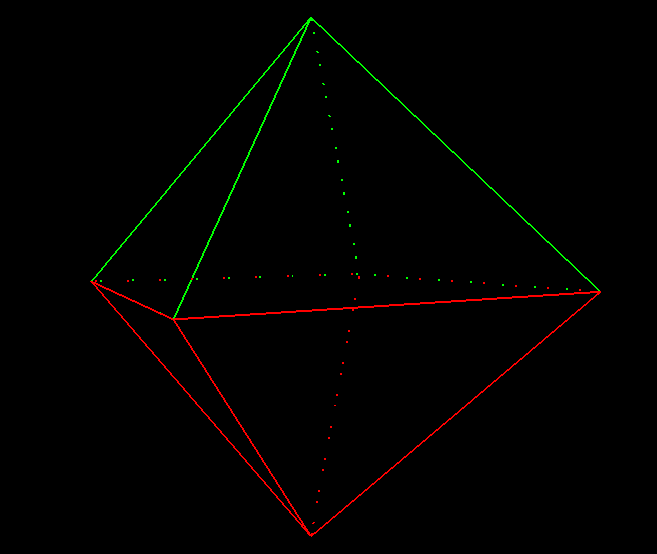

# Octahedron

Drawing an octahedron with lines with the removal of invisible edges using the Roberts algorithm.
Created only for educational purposes.



## Getting started
```console
$ make -B
$ ./main
```
